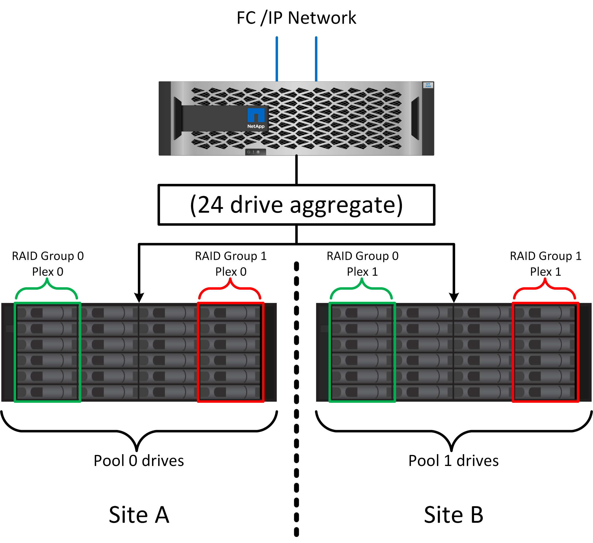
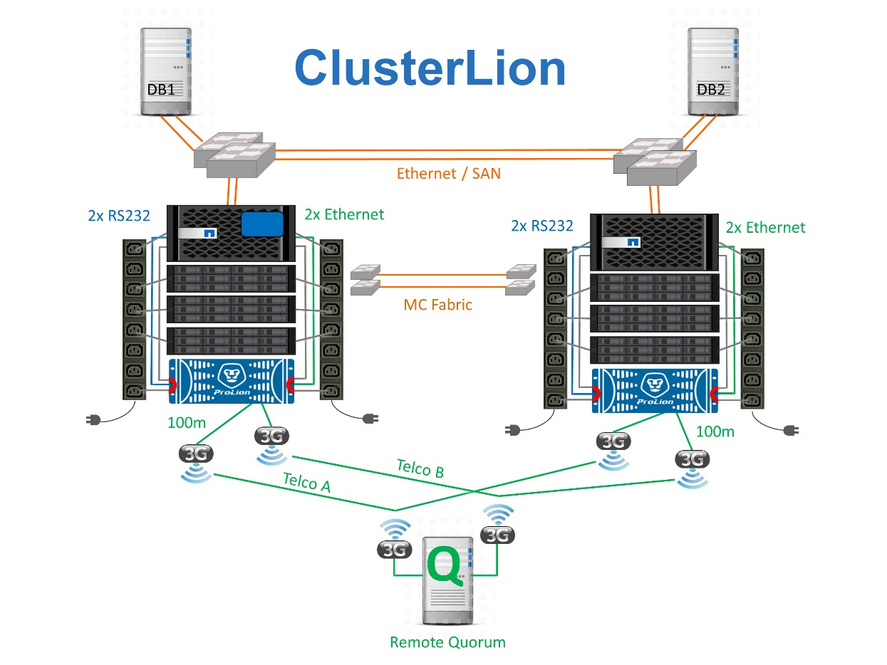

= Protezione da errori del sito: NVRAM e MetroCluster
:allow-uri-read: 

== Protezione da errori del sito: NVRAM e MetroCluster

MetroCluster estende la protezione dei dati NVRAM nei seguenti modi:

* In una configurazione a due nodi, i dati NVRAM vengono replicati attraverso i collegamenti Inter-Switch (ISL) al partner remoto.
* In una configurazione ha-Pair, i dati NVRAM vengono replicati sia nel partner locale che in un partner remoto.
* Una scrittura non viene riconosciuta fino a quando non viene replicata a tutti i partner. Questa architettura protegge gli i/o in fase di trasferimento dai guasti del sito replicando i dati NVRAM a un partner remoto. Il processo non è coinvolto nella replica dei dati a livello di unità. Il controller proprietario degli aggregati si occupa della replica dei dati per iscritto a entrambi i plessi dell'aggregato, ma in caso di perdita del sito occorre comunque proteggere dalle perdite di i/o in fase di trasferimento. I dati NVRAM replicati sono utilizzati solo se un partner controller deve subentrare a un controller guasto.

== Protezione dai guasti di shelf e siti: SyncMirror e plessi

SyncMirror è una tecnologia di mirroring che migliora, ma non sostituisce, RAID DP o RAID-TEC. Esegue il mirroring del contenuto di due gruppi RAID indipendenti. La configurazione logica è la seguente:

. I dischi sono configurati in due pool in base alla posizione. Un pool è composto da tutti i dischi sul sito A, mentre il secondo è composto da tutti i dischi sul sito B.
. Viene quindi creato un pool di storage comune, detto aggregato, in base a set di gruppi RAID con mirroring. Viene ottenuto lo stesso numero di unità per ciascun sito. Ad esempio, un aggregato SyncMirror da 20 dischi sarebbe composto da 10 dischi del sito A e 10 dischi del sito B.
. Ogni set di unità su un dato sito viene configurato automaticamente come uno o più gruppi RAID DP o RAID-TEC completamente ridondanti, indipendentemente dall'utilizzo del mirroring. Questo utilizzo di RAID sottostante il mirroring garantisce la protezione dei dati anche dopo la perdita di un sito.

La figura precedente illustra una configurazione SyncMirror di esempio. È stato creato un aggregato di 24 dischi sul controller con 12 dischi da uno shelf allocato sul sito A e 12 dischi da uno shelf allocato sul sito B. I dischi sono stati raggruppati in due gruppi RAID con mirroring. Il gruppo RAID 0 include un plesso A 6 dischi sul sito A con mirroring su un plesso A 6 dischi sul sito B. Analogamente, il gruppo RAID 1 include un plesso A 6 dischi sul sito A con mirroring su un plesso A 6 dischi sul sito B.

Di norma, SyncMirror viene utilizzato per fornire il mirroring remoto con i sistemi MetroCluster, con una copia dei dati in ciascun sito. A volte, è stato utilizzato per fornire un livello di ridondanza extra in un unico sistema. In particolare, fornisce ridondanza a livello di shelf. Uno shelf di dischi contiene già doppi controller e alimentatori e nel complesso è poco più di una lamiera, ma in alcuni casi è consigliabile garantire una protezione extra. Ad esempio, un cliente NetApp ha implementato SyncMirror per una piattaforma mobile di analytics in tempo reale utilizzata durante i test nel settore automobilistico. Il sistema è stato separato in due rack fisici forniti con alimentatori indipendenti e sistemi UPS indipendenti.

== Errore di ridondanza: NVFAIL

Come discusso in precedenza, una scrittura non viene riconosciuta fino a quando non è stata registrata nella NVRAM locale e nella NVRAM su almeno un altro controller. Questo approccio garantisce che un guasto dell'hardware o un'interruzione di corrente non comporti la perdita dell'i/o in-flight Se si verifica un guasto nella NVRAM locale o nella connettività ad altri nodi, i dati non verranno più mirrorati.

Se la NVRAM locale riporta un errore, il nodo si arresta. Questo arresto determina il failover su un partner controller quando vengono utilizzate coppie ha. Con MetroCluster, il comportamento dipende dalla configurazione complessiva scelta, ma può portare al failover automatico della nota remota. In ogni caso, nessun dato viene perso perché il controller che subisce l'errore non ha confermato l'operazione di scrittura.

Un guasto di connettività site-to-site che blocca la replica NVRAM ai nodi remoti è una situazione più complicata. Le scritture non vengono più replicate sui nodi remoti, con la possibilità di perdita di dati in caso di errore catastrofico su un controller. Cosa più importante, il tentativo di failover su un nodo diverso in queste condizioni comporta una perdita di dati.

Il fattore di controllo è se la NVRAM è sincronizzata. Se la NVRAM è sincronizzata, il failover da nodo a nodo può procedere in tutta sicurezza senza rischio di perdita di dati. In una configurazione MetroCluster, se la NVRAM e i plessi degli aggregati sottostanti sono sincronizzati, è possibile procedere con lo switchover senza rischio di perdita di dati.

ONTAP non consente alcun failover o switchover quando i dati non sono sincronizzati, a meno che non sia forzato il failover o lo switchover. La forzatura di una modifica delle condizioni in questo modo riconosce che i dati potrebbero essere lasciati indietro nel controllore originale e che la perdita di dati è accettabile.

I database e altre applicazioni sono particolarmente vulnerabili al danneggiamento se un failover o uno switchover è forzato perché mantengono cache interne di dati su disco di dimensioni maggiori. In caso di failover o switchover forzato, le modifiche riconosciute in precedenza vengono eliminate del tutto. Il contenuto dell'array di storage torna indietro nel tempo e lo stato della cache non riflette più lo stato dei dati su disco.

Per evitare questa situazione, ONTAP consente di configurare i volumi per una protezione speciale contro i guasti della NVRAM. Quando attivato, questo meccanismo di protezione determina l'ingresso di un volume nello stato chiamato NVFAIL. Questo stato causa errori di i/o che causano un crash dell'applicazione. Questo blocco causa l'arresto delle applicazioni in modo che non utilizzino dati obsoleti. I dati non devono essere persi perché i dati delle transazioni devono essere presenti nei registri. Solitamente, gli amministratori dovranno arrestare completamente gli host prima di riportare manualmente LUN e volumi in linea. Sebbene queste fasi possano comportare un certo lavoro, questo approccio è il modo più sicuro per garantire l'integrità dei dati. Non tutti i dati richiedono questa protezione, motivo per cui il comportamento di NVFAIL può essere configurato in base al volume.

=== Coppie HA e MetroCluster

MetroCluster è disponibile in due configurazioni: Due nodi e coppia ha. La configurazione a due nodi si comporta come una coppia ha in relazione alla NVRAM. In caso di guasto improvviso, il nodo partner può riprodurre i dati della NVRAM per rendere i dischi coerenti e garantire che non vengano perse scritture riconosciute.

La configurazione ha-Pair replica la NVRAM anche sul nodo partner locale. Un semplice guasto al controller porta a un replay della NVRAM sul nodo partner, come nel caso di una coppia ha standalone, senza MetroCluster. In caso di improvvisa perdita completa del sito, il sito remoto dispone anche della NVRAM necessaria per rendere i dischi coerenti e iniziare a fornire i dati.

Un aspetto importante di MetroCluster è che i nodi remoti non hanno accesso ai dati partner in normali condizioni operative. Ogni sito funziona essenzialmente come un sistema indipendente che può assumere la personalità del sito opposto. Questo processo, noto come switchover, include uno switchover pianificato, in cui le operazioni del sito vengono migrate senza interruzioni nel sito opposto. Include anche le situazioni non pianificate in cui si perde un sito ed è necessario uno switchover manuale o automatico come parte del disaster recovery.

== Switchover e switchback

I termini switchover e switchback si riferiscono al processo di transizione dei volumi tra controller remoti in una configurazione MetroCluster. Questo processo si applica solo ai nodi remoti. Se viene utilizzato MetroCluster in una configurazione a quattro volumi, il failover di nodo locale utilizza il medesimo processo di takeover e giveback descritto in precedenza.

=== Switchover e switchback pianificati

Uno switchover o uno switchback pianificato è simile a un takeover o un giveback tra i nodi. Il processo prevede diverse fasi e potrebbe richiedere alcuni minuti, ma in realtà si tratta di una transizione graduale delle risorse di storage e di rete. Il momento in cui il trasferimento del controllo avviene molto più rapidamente del tempo richiesto per l'esecuzione del comando completo.

La differenza principale tra takeover/giveback e switchover/switchback influisce sulla connettività FC SAN. Grazie al takeover/giveback locale, un host subisce la perdita di tutti i percorsi FC nel nodo locale e si affida al proprio MPIO nativo per passare ai percorsi alternativi disponibili. Le porte non vengono ricollocate. Grazie a switchover e switchback, le porte di destinazione FC virtuali sui controller passano all'altro sito. Di fatto, smettono di esistere sulla SAN per un momento e ricompaiono su un controller alternativo.

=== Timeout SyncMirror

SyncMirror è una tecnologia di mirroring ONTAP che fornisce protezione dai guasti agli shelf. Quando gli shelf sono separati su una distanza, il risultato è una data Protection remota.

SyncMirror non fornisce mirroring sincrono universale. Il risultato è una maggiore disponibilità. Alcuni sistemi di archiviazione utilizzano un mirroring costante tutto o niente, talvolta chiamato modalità domino. Questa forma di mirroring è limitata nell'applicazione poiché tutte le attività di scrittura devono cessare se la connessione al sito remoto viene persa. Altrimenti, una scrittura esisterebbe in un sito ma non nell'altro. Generalmente, tali ambienti sono configurati per portare le LUN offline in caso di perdita della connettività sito-sito per più di un breve periodo (ad esempio 30 secondi).

Questo comportamento è desiderabile per un piccolo sottoinsieme di ambienti. Tuttavia, la maggior parte delle applicazioni richiede una soluzione che offra una replica sincrona garantita in normali condizioni operative, ma con la possibilità di sospendere la replica. Una perdita completa della connettività da sito a sito viene spesso considerata una situazione quasi disastrosa. Generalmente, tali ambienti vengono mantenuti online e forniscono dati fino al ripristino della connettività o alla decisione formale di arrestare l'ambiente per proteggere i dati. Un requisito per l'arresto automatico dell'applicazione solo a causa di un errore di replica remota è insolito.

SyncMirror supporta i requisiti di mirroring sincrono con la flessibilità di un timeout. Se la connettività al telecomando e/o al plex viene persa, inizia il conto alla rovescia un timer di 30 secondi. Quando il contatore raggiunge 0, l'elaborazione i/o in scrittura riprende a utilizzare i dati locali. La copia remota dei dati è utilizzabile, ma viene bloccata in tempo fino a quando non viene ripristinata la connettività. La risincronizzazione sfrutta le snapshot a livello di aggregato per riportare il sistema in modalità sincrona il più rapidamente possibile.

In particolare, in molti casi, questo tipo di replica universale in modalità domino a tutto o niente è meglio implementato a livello di applicazione. Ad esempio, Oracle DataGuard include la modalità di protezione massima, che garantisce la replica a lunga istanza in tutte le circostanze. Se il collegamento di replica non riesce per un periodo superiore a un timeout configurabile, i database vengono arrestati.

=== Switchover automatico senza intervento dell'utente con MetroCluster fabric-attached

Lo switchover automatico non assistito (ASOLO) è una funzione MetroCluster collegata al fabric che offre un tipo di ha cross-site. Come indicato in precedenza, MetroCluster è disponibile in due tipi: Un singolo controller su ciascun sito o una coppia ha su ciascun sito. Il vantaggio principale dell'opzione ha è che l'arresto pianificato o non pianificato del controller consente comunque a tutti gli i/o di essere locali. Il vantaggio dell'opzione a nodo singolo consiste nella riduzione di costi, complessità e infrastruttura.

Il valore primario di AUSO è migliorare le capacità ha dei sistemi MetroCluster fabric-attached. Ciascun sito esegue il monitoraggio dello stato di salute del sito opposto e, se non sono ancora presenti nodi che forniscono dati, AUDO esegue un rapido switchover. Questo approccio è particolarmente utile nelle configurazioni MetroCluster con un solo nodo per sito, perché consente di avvicinare la configurazione a una coppia ha in termini di disponibilità.

AUSO non è in grado di offrire un monitoraggio completo a livello di coppia ha. Una coppia ha può offrire una disponibilità estremamente elevata, perché include due cavi fisici ridondanti per la comunicazione diretta da nodo a nodo. Inoltre, entrambi i nodi di una coppia ha hanno accesso allo stesso set di dischi in loop ridondanti, offrendo un altro percorso a un nodo per monitorare la salute di un altro.

I cluster MetroCluster esistono tra i siti per i quali le comunicazioni nodo-nodo e l'accesso al disco si basano sulla connettività di rete site-to-site. La capacità di monitorare il battito cardiaco del resto del cluster è limitata. AUSO deve discriminare tra una situazione in cui l'altro sito è effettivamente inattivo piuttosto che non disponibile a causa di un problema di rete.

Di conseguenza, un controller in una coppia ha può richiedere un takeover se rileva un guasto del controller verificatosi per un motivo specifico, ad esempio un panico del sistema. Può anche richiedere un takeover in caso di perdita totale della connettività, talvolta nota come battito cardiaco perso.

Un sistema MetroCluster può eseguire uno switchover automatico in modo sicuro solo quando viene rilevato un guasto specifico nel sito originale. Inoltre, il controller che prende la proprietà del sistema di storage deve essere in grado di garantire che i dati su disco e NVRAM siano sincronizzati. Il controller non è in grado di garantire la sicurezza di uno switchover solo perché ha perso il contatto con il sito di origine, cosa che potrebbe essere ancora operativa. Per ulteriori opzioni per automatizzare uno switchover, vedere le informazioni sulla soluzione MetroCluster Tiebreaker (MCTB) nella sezione successiva.

=== Tiebreaker MetroCluster con MetroCluster fabric-attached

Il link:https://docs.netapp.com/us-en/ontap-metrocluster/install-ip/task_sw_config_configure_mediator.html["Tiebreaker NetApp MetroCluster"^] software può essere eseguito su un terzo sito per monitorare lo stato dell'ambiente MetroCluster, inviare notifiche e, facoltativamente, imporre uno switchover in una situazione di emergenza. Una descrizione completa di Tiebreaker link:http://mysupport.netapp.com["Sito di supporto NetApp"^]è disponibile sul , ma lo scopo principale di MetroCluster Tiebreaker è quello di rilevare la perdita del sito. Inoltre, deve discriminare tra la perdita del sito e la perdita della connettività. Ad esempio, lo switchover non deve essere eseguito perché il tiebreaker non è riuscito a raggiungere il sito primario; questo spiega perché il tiebreaker monitora anche la capacità del sito remoto di contattare il sito primario.

Lo switchover automatico con AUSO è compatibile anche con l'MCTB. AUSO reagisce in modo molto rapido perché è progettato per rilevare eventi di errore specifici e quindi richiamare lo switchover solo quando i plex NVRAM e SyncMirror sono sincronizzati.

Al contrario, il Tiebreaker è localizzato a distanza e quindi deve attendere che un temporizzatore trascorra prima di dichiarare un sito morto. Il tiebreaker alla fine rileva il tipo di guasto del controller coperto da AUSO, ma in generale AUSO ha già avviato lo switchover e, eventualmente, ha completato lo switchover prima che il tiebreaker agisca. Il secondo comando switchover risultante proveniente dal tiebreaker verrebbe rifiutato.

CAUTION: Il software MCTB non verifica se NVRAM era e/o i plex sono sincronizzati quando si forza uno switchover. Lo switchover automatico, se configurato, deve essere disattivato durante le attività di manutenzione che causano una perdita di sincronizzazione dei plessi NVRAM o SyncMirror.

Inoltre, l'MCTB potrebbe non risolvere un disastro continuo che porta alla seguente sequenza di eventi:

. La connettività tra i siti viene interrotta per più di 30 secondi.
. Timeout della replica SyncMirror e proseguimento delle operazioni sul sito primario, lasciando inattiva la replica remota.
. Il sito primario viene perso. Il risultato è la presenza di modifiche non replicate sul sito primario. Uno switchover potrebbe quindi essere indesiderato per una serie di motivi, tra cui:
+
** I dati critici potrebbero essere presenti sul sito primario e quindi ripristinabili. Uno switchover che ha permesso all'applicazione di continuare a funzionare eliminava efficacemente i dati critici.
** Un'applicazione sul sito rimasto che stava utilizzando le risorse di storage sul sito primario al momento della perdita del sito potrebbe avere memorizzato nella cache i dati. Uno switchover introdurrebbe una versione obsoleta dei dati che non corrisponde alla cache.
** Un sistema operativo del sito rimasto che utilizzava le risorse di storage del sito primario al momento della perdita del sito potrebbe avere memorizzato i dati nella cache. Uno switchover introdurrebbe una versione obsoleta dei dati che non corrisponde alla cache. L'opzione più sicura è configurare tiebreaker in modo da inviare un avviso se rileva un guasto del sito e chiedere a una persona di decidere se forzare uno switchover. Potrebbe essere necessario arrestare le applicazioni e/o i sistemi operativi per cancellare i dati memorizzati nella cache. Inoltre, è possibile utilizzare le impostazioni NVFAIL per aggiungere ulteriore protezione e semplificare il processo di failover.

=== ONTAP Mediator con MetroCluster IP

ONTAP Mediator viene utilizzato con MetroCluster IP e con alcune altre soluzioni ONTAP. Funziona come un servizio di tiebreaker tradizionale, proprio come il software MetroCluster Tiebreaker descritto in precedenza, ma include anche una funzione critica: Eseguire uno switchover automatizzato e non assistito.

Un MetroCluster fabric-attached ha accesso diretto ai dispositivi di storage del sito opposto. Ciò consente a un controller MetroCluster di monitorare lo stato degli altri controller leggendo i dati heartbeat dalle unità. In questo modo, un controller riconosce il guasto di un altro controller ed esegue uno switchover.

Al contrario, l'architettura IP di MetroCluster instrada tutti i/o esclusivamente attraverso la connessione controller-controller; non vi è accesso diretto ai dispositivi di storage sul sito remoto. Questo limita la possibilità per un controller di rilevare gli errori ed eseguire uno switchover. Pertanto, come dispositivo di tiebreaker occorre il ONTAP Mediator per rilevare la perdita di un sito ed eseguire automaticamente uno switchover.

=== Terzo sito virtuale con ClusterLion

ClusterLion è un'appliance di monitoraggio MetroCluster avanzata che funziona come un terzo sito virtuale. Questo approccio consente di implementare MetroCluster in maniera sicura in una configurazione a due siti con una funzionalità di switchover completamente automatizzata. Inoltre, ClusterLion può eseguire ulteriori operazioni di monitoraggio a livello di rete ed eseguire operazioni post-switchover. La documentazione completa è disponibile presso ProLion.

* Gli appliance ClusterLion monitorano lo stato dei controller con cavi Ethernet e seriali collegati direttamente.
* I due dispositivi sono collegati tra loro mediante connessioni wireless 3G ridondanti.
* L'alimentazione alla centralina ONTAP viene instradata attraverso i relè interni. In caso di guasto a un sito, ClusterLion, che contiene un sistema UPS interno, interrompe i collegamenti di alimentazione prima di richiamare uno switchover. Questo processo assicura che non si verifichi alcuna condizione split-brain.
* ClusterLion esegue uno switchover entro il timeout SyncMirror di 30 secondi o non lo esegue affatto.
* ClusterLion non esegue uno switchover a meno che gli stati della NVRAM e dei plex SyncMirror non siano sincronizzati.
* Poiché ClusterLion esegue uno switchover solo se MetroCluster è completamente sincronizzato, NVFAIL non è necessario. Questa configurazione consente ad ambienti che si estendono tra diversi siti, come un Oracle RAC esteso, di rimanere online anche durante uno switchover non pianificato.
* Il supporto include MetroCluster fabric-attached e MetroCluster IP

