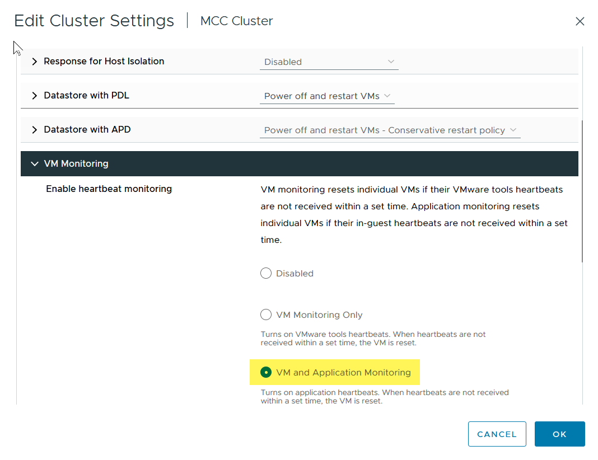

= Linee guida per la progettazione e l'implementazione di vMSC
:hardbreaks:
:allow-uri-read: 
:nofooter: 
:icons: font
:linkattrs: 
:imagesdir: ../media/

[role="lead"]
Questo documento delinea le linee guida di progettazione e implementazione per vMSC con i sistemi di storage ONTAP.

== Configurazione dello storage NetApp

Le istruzioni per l'installazione di NetApp MetroCluster sono disponibili all'indirizzo https://docs.netapp.com/us-en/ontap-metrocluster/["Documentazione MetroCluster"]. Le istruzioni per SnapMirror Active Sync (SMA) sono disponibili anche all'indirizzo https://docs.netapp.com/us-en/ontap/smbc/index.html["Panoramica di SnapMirror Business Continuity"].

Una volta configurato MetroCluster, gestirlo è come gestire un ambiente ONTAP tradizionale. Puoi configurare Storage Virtual Machine (SVM) utilizzando vari strumenti come l'interfaccia a riga di comando (CLI), System Manager o Ansible. Una volta configurate le SVM, occorre creare nel cluster interfacce logiche (LIF), volumi e LUN (Logical Unit Number) da utilizzare per le normali operazioni. Questi oggetti verranno replicati automaticamente sull'altro cluster utilizzando la rete di peering del cluster.

Se non utilizzi MetroCluster, o se disponi di sistemi ONTAP non supportati per MetroCluster, come ad esempio i sistemi ASA R2, puoi utilizzare SnapMirror Active Sync che fornisce una protezione granulare dei datastore e l'accesso Active-Active su più cluster ONTAP in diversi domini di errore. SMA utilizza gruppi di coerenza (CGS) per garantire la coerenza dell'ordine di scrittura tra uno o più datastore ed è possibile creare più CGS in base ai requisiti dell'applicazione e del datastore. I gruppi di coerenza sono particolarmente utili per le applicazioni che richiedono la sincronizzazione dei dati tra datastore multipli. Ad esempio, LVM guest distribuiti tra datastore. SMA supporta inoltre RDM (Raw Device Mapping) e storage connesso al guest con iniziatori iSCSI in-guest. Per ulteriori informazioni sui gruppi di coerenza, visitare il sitoWeb all'indirizzo https://docs.netapp.com/us-en/ontap/consistency-groups/index.html["Panoramica dei gruppi di coerenza"].

Esiste una certa differenza nella gestione di una configurazione vMSC con sincronizzazione attiva SnapMirror rispetto a una MetroCluster. In primo luogo, SMA è una configurazione solo SAN, nessun datastore NFS può essere protetto con la sincronizzazione attiva di SnapMirror. In secondo luogo, è necessario mappare entrambe le copie delle LUN agli host ESXi per accedere ai datastore replicati in entrambi i domini di errore. Terzo, devi creare uno o più gruppi di coerenza per i datastore da proteggere con la sincronizzazione attiva di SnapMirror. Infine, è necessario creare un criterio SnapMirror per i gruppi di coerenza creati. Tutto questo può essere fatto facilmente usando la procedura guidata "Protect cluster" nel plug-in vCenter di ONTAP tools, o usando manualmente la CLI di ONTAP o System Manager.

== Utilizzo del plug-in vCenter di ONTAP Tools per SnapMirror Active Sync

Il plug-in vCenter degli strumenti ONTAP fornisce un modo semplice e intuitivo per configurare SnapMirror Active Sync per vMSC. Puoi usare il plug-in vCenter di ONTAP Tools per creare e gestire relazioni di sincronizzazione attive di SnapMirror tra due cluster ONTAP. Questo plugin fornisce un'interfaccia di facile utilizzo per stabilire e gestire queste relazioni in modo efficiente. Per ulteriori informazioni sul plug-in vCenter degli strumenti ONTAP, visitare il sito Web all'indirizzo https://docs.netapp.com/us-en/ontap-tools-vmware-vsphere-10/index.html["Strumenti ONTAP per VMware vSphere"], oppure accedere direttamente a https://docs.netapp.com/us-en/ontap-tools-vmware-vsphere-10/configure/protect-cluster.html["Proteggere utilizzando la protezione del cluster host"].

== Configurazione di VMware vSphere

=== Creare un cluster vSphere ha

La creazione di un cluster vSphere ha è un processo in più fasi documentato all'indirizzo https://docs.vmware.com/en/VMware-vSphere/8.0/vsphere-vcenter-esxi-management/GUID-F7818000-26E3-4E2A-93D2-FCDCE7114508.html["Come creare e configurare i cluster nel client vSphere su docs.vmware.com"]. In poche parole, devi prima creare un cluster vuoto, quindi, utilizzando vCenter, devi aggiungere host e specificare l'ha vSphere del cluster e le altre impostazioni.

NOTE: Nessuna disposizione del presente documento sostituisce https://www.vmware.com/docs/vmw-vmware-vsphere-metro-storage-cluster-recommended-practices["Procedure consigliate per VMware vSphere Metro Storage Cluster"]. Questo contenuto viene fornito a scopo di riferimento e non sostituisce la documentazione ufficiale VMware.

Per configurare un cluster ha, completare i seguenti passaggi:

. Connettersi all'interfaccia utente di vCenter.
. In host e cluster, individuare il data center in cui si desidera creare il cluster ha.
. Fare clic con il pulsante destro del mouse sull'oggetto del data center e selezionare nuovo cluster. In base alle nozioni di base, assicurarsi di aver abilitato vSphere DRS e vSphere ha. Completare la procedura guidata.

image::../media/vmsc_3_1.png[Nuovo cluster,624,302]

. Selezionare il cluster e accedere alla scheda di configurazione. Selezionare vSphere ha e fare clic su Modifica.
. In monitoraggio host, selezionare l'opzione attiva monitoraggio host.

image::../media/vmsc_3_2.png[Attivare l'opzione monitoraggio host,624,475]

. Nella scheda guasti e risposte, in monitoraggio VM, selezionare l'opzione solo monitoraggio VM o monitoraggio VM e applicazione.

. In controllo ammissione, impostare l'opzione di controllo ammissione ha su Cluster Resource Reserve; utilizzare 50% CPU/MEM.

image::../media/vmsc_3_4.png[Controllo ammissione,624,479]

. Fare clic su "OK".
. Selezionare DRS e fare clic su MODIFICA.
. Impostare il livello di automazione su manuale, a meno che non sia richiesto dalle applicazioni.

image::../media/vmsc_3_5.png[vmsc 3 5,624,336]

. Abilitare la protezione dei componenti VM, fare riferimento a. https://docs.vmware.com/en/VMware-vSphere/8.0/vsphere-availability/GUID-F01F7EB8-FF9D-45E2-A093-5F56A788D027.html["docs.vmware.com"].
. Le seguenti impostazioni aggiuntive di vSphere ha sono consigliate per vMSC con MetroCluster:

[cols="50%,50%"]
|===
| Guasto | Risposta 

| Errore host | Riavviare le VM 

| Isolamento degli host | Disattivato 

| Datastore con perdita permanente di dispositivi (PDL) | Spegnere e riavviare le macchine virtuali 

| Datastore con tutti i percorsi verso il basso (APD) | Spegnere e riavviare le macchine virtuali 

| L'ospite non batte il cuore | Ripristinare le VM 

| Policy di riavvio della VM | Determinato dall'importanza della VM 

| Risposta per l'isolamento dell'host | Arrestare e riavviare le VM 

| Risposta per il datastore con PDL | Spegnere e riavviare le macchine virtuali 

| Risposta per datastore con APD | Spegnere e riavviare le macchine virtuali (conservative) 

| Ritardo del failover delle macchine virtuali per APD | 3 minuti 

| Risposta per il ripristino APD con timeout APD | Disattivato 

| Sensibilità di monitoraggio VM | Preimpostazione alta 
|===

=== Configurare gli archivi dati per Heartbeating

VSphere ha utilizza i datastore per monitorare gli host e le macchine virtuali in caso di guasto alla rete di gestione. È possibile configurare in che modo vCenter seleziona i datastore heartbeat. Per configurare gli archivi dati per il heartbeat, completare i seguenti passaggi:

. Nella sezione Heartbeating del datastore, selezionare Usa archivi dati dall'elenco specificato e completare automaticamente se necessario.
. Seleziona i datastore che desideri utilizzare vCenter da entrambi i siti e premi OK.

image::../media/vmsc_3_6.png[Schermata della descrizione di un computer generata automaticamente,624,540]

=== Configurare le opzioni avanzate

Gli eventi di isolamento si verificano quando gli host all'interno di un cluster ha perdono la connettività alla rete o ad altri host nel cluster. Per impostazione predefinita, vSphere ha utilizzerà il gateway predefinito per la propria rete di gestione come indirizzo di isolamento predefinito. Tuttavia, è possibile specificare indirizzi di isolamento aggiuntivi per l'host al ping per determinare se deve essere attivata una risposta di isolamento. Aggiungere due IP di isolamento in grado di eseguire il ping, uno per sito. Non utilizzare l'indirizzo IP del gateway. L'impostazione avanzata vSphere ha utilizzata è das.isolationaddress. A tale scopo, è possibile utilizzare gli indirizzi IP ONTAP o Mediator.

Fare riferimento a https://www.vmware.com/docs/vmw-vmware-vsphere-metro-storage-cluster-recommended-practices["Procedure consigliate per VMware vSphere Metro Storage Cluster"] per ulteriori informazioni__.__

image::../media/vmsc_3_7.png[Schermata della descrizione di un computer generata automaticamente,624,545]

L'aggiunta di un'impostazione avanzata denominata das.heartbeatDsPerHost può aumentare il numero di datastore heartbeat. Utilizzare quattro datastore heartbeat (HB DSS), due per sito. Utilizzare l'opzione "Seleziona dall'elenco ma complimento". Questo è necessario perché se un sito non funziona, è necessario ancora due HB DSS. Tuttavia, questi elementi non devono essere protetti con la sincronizzazione attiva di MetroCluster o SnapMirror.

Fare riferimento a https://www.vmware.com/docs/vmw-vmware-vsphere-metro-storage-cluster-recommended-practices["Procedure consigliate per VMware vSphere Metro Storage Cluster"] per ulteriori informazioni__.__

Affinità con VMware DRS per NetApp MetroCluster

In questa sezione vengono creati gruppi DRS per VM e host per ciascun sito/cluster nell'ambiente MetroCluster. Quindi configuriamo le regole VM\host per allineare l'affinità dell'host VM con le risorse di storage locali. Ad esempio, il sito A fa parte del gruppo VM sitea_VM e gli host del sito A appartengono al gruppo host sitea_hosts. Successivamente, in VM\host Rules, si afferma che sitea_vm deve essere eseguito sugli host in sitea_hosts.

[TIP]
====
* NetApp consiglia vivamente la specifica *deve essere eseguita sugli host nel gruppo* piuttosto che sulla specifica *deve essere eseguita sugli host nel gruppo*. In caso di guasto dell'host del sito A, è necessario riavviare le macchine virtuali del sito A sugli host del sito B attraverso vSphere ha, ma quest'ultima specifica non consente all'ha di riavviare le macchine virtuali sul sito B perché è una regola rigida. La specifica precedente è una regola debole e viene violata in caso di ha, abilitando in tal modo la disponibilità anziché le prestazioni.
* È possibile creare un allarme basato su eventi che viene attivato quando una macchina virtuale viola una regola di affinità VM-host. Nel client vSphere, aggiungere un nuovo allarme per la macchina virtuale e selezionare "VM is Violating VM-host Affinity Rule" (VM viola la regola di affinità VM-host) come trigger dell'evento. Per ulteriori informazioni sulla creazione e la modifica degli allarmi, consultare link:https://techdocs.broadcom.com/us/en/vmware-cis/vsphere/vsphere/8-0/vsphere-monitoring-and-performance-8-0.html["Monitoraggio e performance di vSphere"^]la documentazione.

====

=== Creare gruppi host DRS

Per creare gruppi di host DRS specifici per il sito A e il sito B, attenersi alla seguente procedura:

. Nel client web vSphere, fare clic con il pulsante destro del mouse sul cluster nell'inventario e selezionare Impostazioni.
. Fare clic su VM\host Groups.
. Fare clic su Aggiungi.
. Digitare il nome del gruppo (ad esempio, sitea_hosts).
. Dal menu tipo, selezionare Gruppo host.
. Fare clic su Aggiungi e selezionare gli host desiderati dal sito A, quindi fare clic su OK.
. Ripetere questi passaggi per aggiungere un altro gruppo di host per il sito B.
. Fare clic su OK.

=== Creare gruppi DRS VM

Per creare gruppi di macchine virtuali DRS specifici per il sito A e il sito B, attenersi alla seguente procedura:

. Nel client web vSphere, fare clic con il pulsante destro del mouse sul cluster nell'inventario e selezionare Impostazioni.

. Fare clic su VM\host Groups.
. Fare clic su Aggiungi.
. Digitare il nome del gruppo (ad esempio, sitea_vm).
. Dal menu tipo, selezionare Gruppo VM.
. Fare clic su Add (Aggiungi) e selezionare le VM desiderate dal sito A, quindi fare clic su OK.
. Ripetere questi passaggi per aggiungere un altro gruppo di host per il sito B.
. Fare clic su OK.

=== Crea regole host VM

Per creare regole di affinità DRS specifiche per il sito A e il sito B, completare i seguenti passaggi:

. Nel client web vSphere, fare clic con il pulsante destro del mouse sul cluster nell'inventario e selezionare Impostazioni.

. Fare clic su VM\host Rules.
. Fare clic su Aggiungi.
. Digitare il nome della regola (ad esempio, sitea_Affinity).
. Verificare che l'opzione Enable Rule (attiva regola) sia selezionata.
. Dal menu Type (tipo), selezionare Virtual Machines to hosts (macchine virtuali a host).
. Selezionare il gruppo VM (ad esempio, sitea_vm).
. Selezionare il gruppo host (ad esempio, sitea_hosts).
. Ripetere questi passaggi per aggiungere un'altra VM\regola host per il sito B.
. Fare clic su OK.

image::../media/vmsc_3_8.png[Schermata della descrizione di un computer generata automaticamente,474,364]

== Crea cluster di datastore se necessario

Per configurare un cluster di datastore per ciascun sito, attenersi alla seguente procedura:

. Utilizzando il client web vSphere, individuare il data center in cui risiede il cluster ha in Storage.
. Fare clic con il pulsante destro del mouse sull'oggetto del data center e selezionare Storage > New Datastore Cluster.

[TIP]
====
*Quando si utilizza l'archiviazione ONTAP, si consiglia di disattivare l'archiviazione DRS.

* I DRS di archiviazione non sono generalmente necessari o consigliati per l'uso con i sistemi di archiviazione ONTAP.
* ONTAP offre proprie funzionalità di efficienza dello storage, come deduplica, compressione e compaction, che possono essere influenzate dallo Storage DRS.
* Se si utilizzano snapshot ONTAP, storage vMotion lascerebbe la copia della macchina virtuale nella snapshot, aumentando potenzialmente l'utilizzo dello storage e potrebbe avere un impatto sulle applicazioni di backup, come NetApp SnapCenter, che tengono traccia delle macchine virtuali e delle relative snapshot ONTAP.

====
image::../media/vmsc_3_9.png[DRS dello storage,528,94]

. Selezionare il cluster ha e fare clic su Next.

image::../media/vmsc_3_11.png[Cluster HA,624,149]

. Selezionare gli archivi dati appartenenti al sito A e fare clic su Avanti.

image::../media/vmsc_3_12.png[datastore,624,134]

. Rivedere le opzioni e fare clic su fine.
. Ripetere questa procedura per creare il cluster di datastore del sito B e verificare che siano selezionati solo i datastore del sito B.

=== Disponibilità di vCenter Server

Le appliance vCenter Server (VCSA) devono essere protette con vCenter ha. VCenter ha ti consente di implementare due VCSA in una coppia ha Active-passive. Uno in ogni dominio di errore. Puoi leggere ulteriori informazioni su vCenter ha all'indirizzo https://docs.vmware.com/en/VMware-vSphere/8.0/vsphere-availability/GUID-4A626993-A829-495C-9659-F64BA8B560BD.html["docs.vmware.com"].
