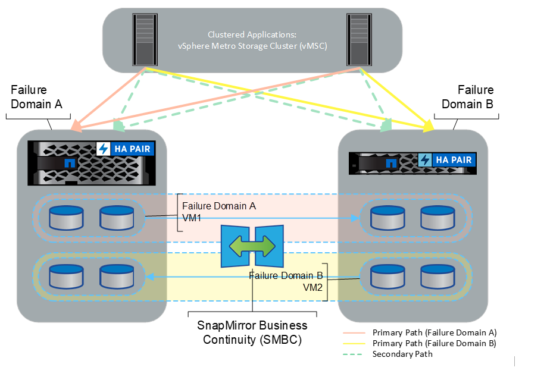

= VSphere Metro Storage Cluster con ONTAP
:hardbreaks:
:allow-uri-read: 
:nofooter: 
:icons: font
:linkattrs: 
:imagesdir: ../media/

[role="lead"]
L'hypervisor vSphere leader del settore di VMware può essere implementato come cluster stretched indicato come vSphere Metro Storage Cluster (vMSC).

Le soluzioni vMSC sono supportate sia con NetApp® MetroCluster che con SnapMirror Active Sync (precedentemente noto come SnapMirror Business Continuity o SMBC) e forniscono una business continuity avanzata se uno o più domini di errore subiscono un'interruzione totale delle attività. La resilienza alle diverse modalità di errore dipende dalle opzioni di configurazione scelte.

== Soluzioni di disponibilità continua per ambienti vSphere

L'architettura ONTAP è una piattaforma di storage flessibile e scalabile che fornisce servizi SAN (FCP, iSCSI e NVMe-of) e NAS (NFS v3 e v4,1) per datastore. I sistemi storage NetApp AFF, ASA e FAS utilizzano il sistema operativo ONTAP per offrire protocolli aggiuntivi per l'accesso allo storage guest, come S3 e SMB.

NetApp MetroCluster utilizza la funzione di ha (failover del controller o CFO) di NetApp per la protezione dai guasti dei controller. Include inoltre la tecnologia SyncMirror locale, il failover cluster in caso di disastro (failover controller on-demand o CFOD), la ridondanza hardware e la separazione geografica per ottenere livelli elevati di disponibilità. SyncMirror esegue il mirroring sincrono dei dati tra le due metà della configurazione MetroCluster scrivendo i dati su due plessi: Il plesso locale (sullo shelf locale) fornendo attivamente i dati e il plesso remoto (sullo shelf remoto) normalmente non fornendo i dati. La ridondanza hardware viene implementata per tutti i componenti MetroCluster, come controller, storage, cavi, switch (utilizzati con Fabric MetroCluster) e adattatori.

La sincronizzazione attiva di NetApp SnapMirror fornisce una protezione granulare dei datastore con protocolli SAN FCP e iSCSI, permettendoti di proteggere in modo selettivo solo i carichi di lavoro ad alta priorità. Offre accesso Active-Active simmetrico su entrambi i siti con mirroring, a differenza di NetApp MetroCluster, che è una soluzione Active-standby.

Per creare un cluster VMware ha/DRS su due siti, gli host ESXi vengono utilizzati e gestiti da un'appliance vCenter Server (VCSA). Le reti di gestione vSphere, vMotion® e delle macchine virtuali sono collegate tramite una rete ridondante tra i due siti. VCenter Server che gestisce il cluster ha/DRS può connettersi agli host ESXi in entrambi i siti e deve essere configurato utilizzando vCenter ha.

Fare riferimento a. https://docs.vmware.com/en/VMware-vSphere/8.0/vsphere-vcenter-esxi-management/GUID-F7818000-26E3-4E2A-93D2-FCDCE7114508.html["Come creare e configurare i cluster nel client vSphere"] Per configurare vCenter ha.

Fare riferimento anche alla sezione https://core.vmware.com/resource/vmware-vsphere-metro-storage-cluster-recommended-practices["Procedure consigliate per VMware vSphere Metro Storage Cluster"].

== Che cos'è vSphere Metro Storage Cluster?

VSphere Metro Storage Cluster (vMSC) è una configurazione certificata che protegge le macchine virtuali (VM) e i container dai guasti. Ciò si ottiene utilizzando concetti di storage estesi insieme ai cluster di host ESXi, distribuiti in diversi domini di errore come rack, edifici, campus o persino città. Le tecnologie di storage Active Sync di NetApp MetroCluster e SnapMirror vengono utilizzate per fornire ai cluster host una protezione rispettivamente con RPO=0 o near RPO=0. La configurazione vMSC è progettata per garantire che i dati siano sempre disponibili, anche in caso di errore di un "sito" fisico o logico completo. Un dispositivo di storage che fa parte della configurazione vMSC deve essere certificato dopo aver superato un processo di certificazione vMSC di successo. Tutti i dispositivi di archiviazione supportati sono disponibili nella https://www.vmware.com/resources/compatibility/search.php["Guida alla compatibilità dello storage VMware"].

Per ulteriori informazioni sulle linee guida di progettazione per vSphere Metro Storage Cluster, consultare la seguente documentazione:

* https://kb.vmware.com/s/article/2031038["Supporto di VMware vSphere con NetApp MetroCluster"]
* https://kb.vmware.com/s/article/83370["Supporto di VMware vSphere con business continuity di NetApp SnapMirror"] (Adesso noto come SnapMirror Active Sync)

A seconda delle considerazioni sulla latenza, NetApp MetroCluster può essere implementato in due diverse configurazioni da utilizzare con vSphere:

* Stretch MetroCluster
* Fabric MetroCluster

Di seguito viene illustrato uno schema topologico di alto livello di Stretch MetroCluster.

image::../media/vmsc_1_1.png[Diagramma vMSC con MCC,624,485]

Fare riferimento a. https://www.netapp.com/support-and-training/documentation/metrocluster/["Documentazione MetroCluster"] Per informazioni specifiche sulla progettazione e la distribuzione di MetroCluster.

SnapMirror Active Sync può anche essere implementato in due modi diversi.

* Asimmetrico
* Simmetrico (anteprima privata in ONTAP 9.14.1)

Fare riferimento a. https://docs.netapp.com/us-en/ontap/smbc/index.html["Documenti NetApp"] Per informazioni specifiche sulla progettazione e la distribuzione per la sincronizzazione attiva di SnapMirror.
