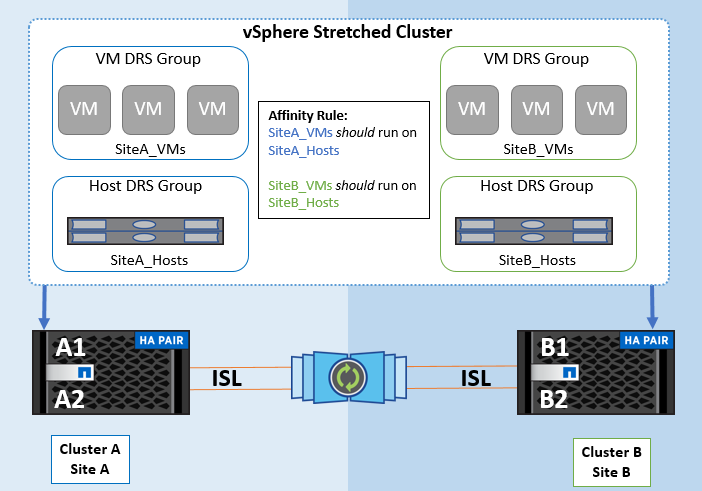

= Panoramica della soluzione VMware vSphere
:hardbreaks:
:allow-uri-read: 
:nofooter: 
:icons: font
:linkattrs: 
:imagesdir: ../media/

[role="lead"]
vCenter Server Appliance (VCSA) è un potente sistema di gestione centralizzata e un unico pannello di controllo per vSphere che consente agli amministratori di gestire in modo efficace i cluster ESXi. Facilita funzioni chiave quali il provisioning delle VM, il funzionamento di vMotion, l'alta disponibilità (HA), il Distributed Resource Scheduler (DRS), VMware vSphere Kubernetes Service (VKS) e molto altro. È un componente essenziale negli ambienti cloud VMware e dovrebbe essere progettato tenendo presente la disponibilità del servizio.

== Alta disponibilità vSphere

La tecnologia cluster di VMware raggruppa i server ESXi in pool di risorse condivise per le macchine virtuali e fornisce vSphere High Availability (ha), offrendo un'elevata disponibilità e una semplicità d'uso per le applicazioni eseguite su macchine virtuali. Quando la funzionalità ha è abilitata sul cluster, ogni server ESXi mantiene la comunicazione con altri host in modo che, se un host ESXi non risponde o si isola, il cluster di ha può negoziare il recovery delle macchine virtuali in esecuzione sull'host ESXi tra gli host sopravvissuti nel cluster. In caso di errore del sistema operativo guest, vSphere ha può riavviare la macchina virtuale interessata sullo stesso server fisico. VSphere ha consente di ridurre i tempi di inattività pianificati, prevenire i tempi di inattività non pianificati e ripristinare rapidamente i dati in caso di interruzioni.

Cluster vSphere HA che ripristina le VM da un server guasto.

image::../media/vmsc_2_1.png[Diagramma vMSC,624,301]

È importante comprendere che VMware vSphere non conosce la sincronizzazione attiva di NetApp MetroCluster o SnapMirror e vede tutti gli host ESXi nel cluster vSphere come host idonei per le operazioni del cluster ha in base alle configurazioni di affinità dei gruppi host e VM.

== Rilevamento errori host

Non appena viene creato il cluster HA, tutti gli host nel cluster partecipano all'elezione e uno degli host diventa master. Ogni slave esegue un heartbeat di rete verso il master, e il master, a sua volta, esegue un heartbeat di rete su tutti gli host slave. L'host master di un cluster vSphere HA è responsabile del rilevamento dei guasti degli host slave.

A seconda del tipo di errore rilevato, potrebbe essere necessario eseguire il failover delle macchine virtuali in esecuzione sugli host.

In un cluster vSphere ha, vengono rilevati tre tipi di errore dell'host:

* Errore - Un host smette di funzionare.
* Isolamento - Un host diventa isolato dalla rete.
* Partizione - Un host perde la connettività di rete con l'host master.

L'host master monitora gli host slave nel cluster. Questa comunicazione viene fatta attraverso lo scambio di heartbeat di rete ogni secondo. Quando l'host master smette di ricevere questi heartbeat da un host slave, controlla la liveness dell'host prima di dichiarare che l'host non è riuscito. Il controllo liveness che l'ospite principale effettua è di determinare se l'ospite secondario sta scambiando i heartbeat con uno dei datastore. Inoltre, l'host master verifica se l'host risponde ai ping ICMP inviati ai propri indirizzi IP di gestione per rilevare se è semplicemente isolato dal suo nodo master o completamente isolato dalla rete. Per farlo, eseguire il ping del gateway predefinito. È possibile specificare manualmente uno o più indirizzi di isolamento per migliorare l'affidabilità della convalida dell'isolamento.

[TIP]
====
NetApp consiglia di specificare un minimo di due indirizzi di isolamento aggiuntivi e che ciascuno di questi indirizzi sia locale al sito. Ciò migliorerà l'affidabilità della convalida dell'isolamento.

====

== Risposta di isolamento dell'host

Isolation Response è un'impostazione di vSphere HA che determina l'azione attivata sulle macchine virtuali quando un host in un cluster vSphere HA perde le sue connessioni di rete di gestione ma continua a funzionare. Sono disponibili tre opzioni per questa impostazione: "Disabilitato", "Arresta e riavvia le VM" e "Spegni e riavvia le VM".

"Arresta" è meglio di "Spegni", che non elimina le modifiche più recenti sul disco né esegue il commit delle transazioni. Se le macchine virtuali non si sono arrestate entro 300 secondi, vengono spente. Per modificare il tempo di attesa, utilizzare l'opzione avanzata das.isolationshutdowntimeout.

Prima che ha avvii la risposta di isolamento, verifica prima se l'agente master ha vSphere è proprietario del datastore che contiene i file di configurazione della VM. In caso contrario, l'host non attiverà la risposta di isolamento, poiché non vi è alcun master per riavviare le VM. L'host controllerà periodicamente lo stato del datastore per determinare se viene richiesto da un agente vSphere ha che detiene il ruolo master.

[TIP]
====
NetApp consiglia di impostare la risposta di isolamento dell'host su Disabilitato.

====
Una condizione split-brain può verificarsi se un host viene isolato o partizionato dall'host master vSphere ha e il master non è in grado di comunicare tramite datastore heartbeat o tramite ping. Il master dichiara l'host isolato inattivo e riavvia le macchine virtuali su altri host nel cluster. Esiste ora una condizione split-brain perché esistono due istanze della macchina virtuale in esecuzione, una sola delle quali è in grado di leggere o scrivere i dischi virtuali. Le condizioni split-brain possono ora essere evitate configurando VMCP (VM Component Protection).

== Protezione dei componenti VM (VMCP)

Uno dei miglioramenti delle funzionalità di vSphere 6, relativi all'ha, è VMCP. VMCP fornisce una protezione avanzata da APD (All Path Down) e PDL (Permanent Device Loss) per lo storage a blocchi (FC, iSCSI, FCoE) e a file (NFS).

=== Perdita permanente del dispositivo (PDL)

PDL è una condizione che si verifica quando un dispositivo di archiviazione si guasta in modo permanente o viene rimosso amministrativamente e non si prevede che verrà ripristinato. L'array di archiviazione NetApp invia un codice SCSI Sense a ESXi, dichiarando che il dispositivo è stato perso definitivamente. Nella sezione Condizioni di errore e risposta della VM di vSphere HA, è possibile configurare la risposta da adottare dopo il rilevamento di una condizione PDL.

[TIP]
====
NetApp consiglia di impostare la "Risposta per Datastore con PDL" su "*Spegni e riavvia le VM*". Quando viene rilevata questa condizione, una VM verrà riavviata immediatamente su un host funzionante all'interno del cluster vSphere HA.

====

=== Tutti i percorsi verso il basso (APD)

APD è una condizione che si verifica quando un dispositivo di archiviazione diventa inaccessibile all'host e non sono disponibili percorsi verso l'array. ESXi ritiene che si tratti di un problema temporaneo del dispositivo e si aspetta che torni disponibile.

Quando viene rilevata una condizione APD, viene avviato un timer. Dopo 140 secondi, la condizione APD viene dichiarata ufficialmente e il dispositivo viene contrassegnato come timeout APD. Una volta trascorsi i 140 secondi, ha inizia il conteggio dei minuti specificati nell'APD Delay for VM failover. Una volta trascorso il tempo specificato, ha riavvia le macchine virtuali interessate. È possibile configurare VMCP in modo che risponda in modo diverso, se lo si desidera (Disattivato, Eventi problema o Spegni e riavvia le macchine virtuali).

[TIP]
====
* NetApp consiglia di configurare "Risposta per datastore con APD" su "*Spegni e riavvia le VM (conservative)*".
* Con "conservativo" si intende la probabilità che HA sia in grado di riavviare le VM. Se impostato su Conservativo, HA riavvierà la VM interessata dall'APD solo se sa che un altro host può riavviarla. Nel caso di Aggressive, HA tenterà di riavviare la VM anche se non conosce lo stato degli altri host. Ciò può comportare il mancato riavvio delle VM se non è presente alcun host con accesso al datastore in cui si trovano.
* Se lo stato APD viene risolto e l'accesso allo storage viene ripristinato prima che sia trascorso il timeout, ha non riavvierà inutilmente la macchina virtuale a meno che non sia stata esplicitamente configurata. Se si desidera una risposta anche quando l'ambiente è stato ripristinato dalla condizione APD, è necessario configurare la risposta per il ripristino APD dopo il timeout APD in modo da ripristinare le VM.
* NetApp consiglia di configurare la risposta per il ripristino APD dopo il timeout APD su Disabilitato.

====

== Implementazione di VMware DRS per NetApp SnapMirror Active Sync

VMware DRS è una funzionalità che aggrega le risorse host in un cluster e viene utilizzata principalmente per il bilanciamento del carico all'interno di un cluster in un'infrastruttura virtuale. VMware DRS calcola principalmente le risorse di CPU e memoria per eseguire il bilanciamento del carico in un cluster. Poiché vSphere non è consapevole del clustering allungato, considera tutti gli host in entrambi i siti durante il bilanciamento del carico.

== Implementazione VMware DRS per NetApp MetroCluster

 To avoid cross-site traffic, NetApp recommends configuring DRS affinity rules to manage a logical separation of VMs. This will ensure that, unless there is a complete site failure, HA and DRS will only use local hosts.
Se si crea una regola di affinità DRS per il cluster, è possibile specificare in che modo vSphere applica tale regola durante il failover di una macchina virtuale.

Esistono due tipi di regole che è possibile specificare per il comportamento del failover di vSphere HA:

* Le regole di anti-affinità delle macchine virtuali costringono le macchine virtuali specificate a rimanere separate durante le azioni di failover.
* Le regole di affinità degli host VM collocano macchine virtuali specifiche su un host specifico o su un membro di un gruppo definito di host durante le azioni di failover.

Utilizzando le regole di affinità degli host delle macchine virtuali in VMware DRS, si può avere una separazione logica tra il sito A e il sito B in modo che la macchina virtuale venga eseguita sull'host nello stesso sito dell'array configurato come controller di lettura/scrittura principale per un determinato datastore. Inoltre, le regole di affinità degli host delle macchine virtuali consentono alle macchine virtuali di rimanere locali rispetto allo storage, il che a sua volta determina la connessione della macchina virtuale in caso di errori di rete tra i siti.

Di seguito è riportato un esempio di gruppi di host VM e regole di affinità.

=== _Best practice_

NetApp consiglia di implementare regole "should" invece di regole "must", in quanto vengono violate da vSphere ha in caso di errore. L'utilizzo di regole "must" potrebbe potenzialmente causare interruzioni del servizio.

La disponibilità dei servizi dovrebbe sempre prevalere sulle prestazioni. Nello scenario in cui un data center completo fallisce, le regole "must" devono scegliere gli host dal gruppo di affinità degli host delle VM e, quando il data center non è disponibile, le macchine virtuali non verranno riavviate.

== Implementazione di VMware Storage DRS con NetApp MetroCluster

La funzionalità VMware Storage DRS consente l'aggregazione di datastore in una singola unità e bilancia i dischi della macchina virtuale quando vengono superate le soglie di controllo i/o di storage (SIOC).

Il controllo i/o dello storage è abilitato per impostazione predefinita sui cluster DRS abilitati per Storage DRS. Il controllo i/o dello storage consente a un amministratore di controllare la quantità di i/o dello storage allocata alle macchine virtuali nei periodi di congestione dell'i/o e di conseguenza le macchine virtuali più importanti possono preferire le macchine virtuali meno importanti per l'allocazione delle risorse i/O.

Storage DRS utilizza Storage vMotion per migrare le macchine virtuali in datastore diversi all'interno di un cluster di datastore. In un ambiente NetApp MetroCluster, la migrazione di una macchina virtuale deve essere controllata all'interno dei datastore di quel sito. Ad esempio, la macchina virtuale A, in esecuzione su un host nel sito A, dovrebbe idealmente migrare all'interno dei datastore della SVM nel sito A. In caso contrario, la macchina virtuale continuerà a funzionare ma con prestazioni ridotte, poiché la lettura/scrittura del disco virtuale avverrà dal sito B attraverso collegamenti tra siti.

[TIP]
====
*Quando si utilizza l'archiviazione ONTAP, si consiglia di disattivare l'archiviazione DRS.

* I DRS di archiviazione non sono generalmente necessari o consigliati per l'uso con i sistemi di archiviazione ONTAP.
* ONTAP offre proprie funzionalità di efficienza dello storage, come deduplica, compressione e compaction, che possono essere influenzate dallo Storage DRS.
* Se si utilizzano snapshot ONTAP , Storage vMotion lascerebbe indietro la copia della VM nello snapshot, aumentando potenzialmente l'utilizzo dello storage e potrebbe avere un impatto sulle applicazioni di backup come NetApp SnapCenter, che tiene traccia delle VM e dei relativi snapshot ONTAP .

====